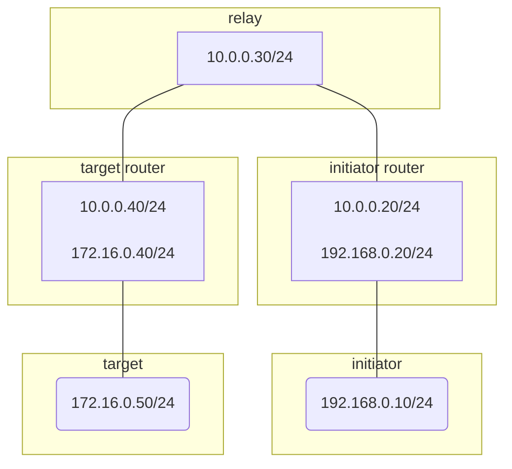
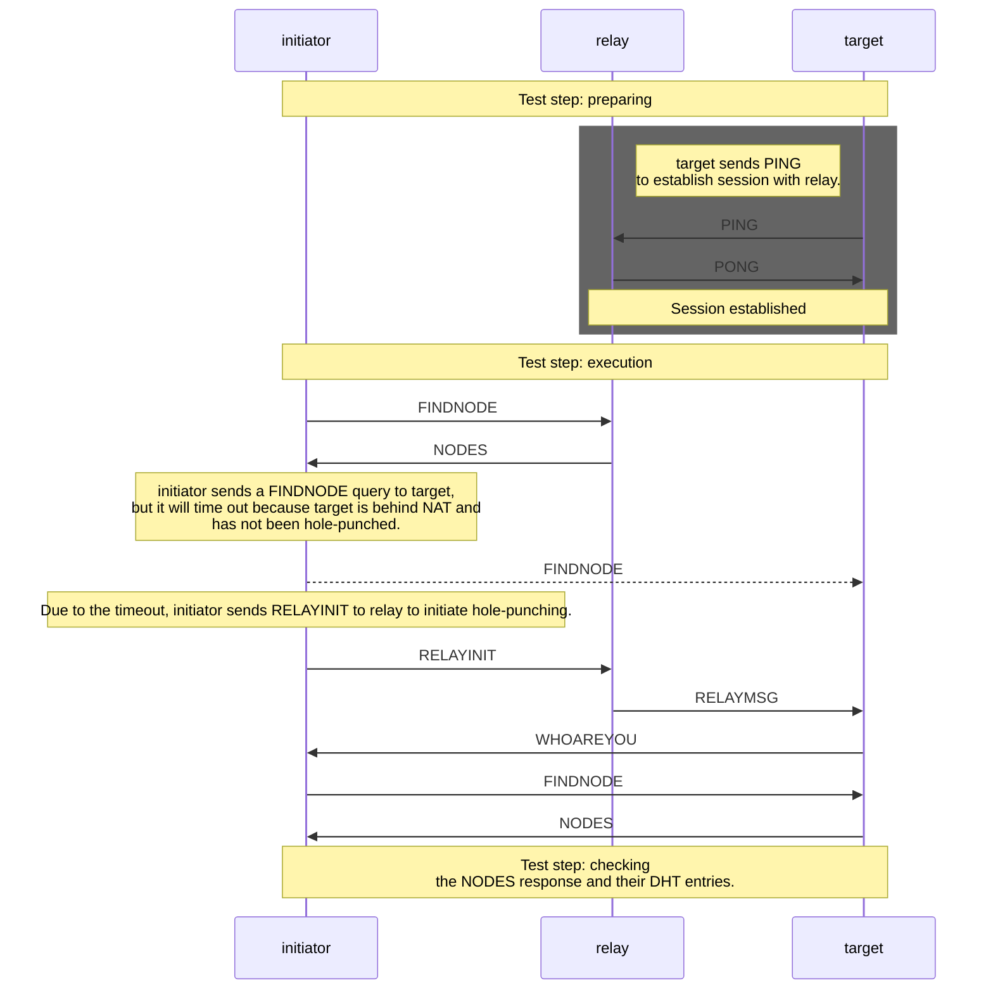

# discv5-hole-punching

This repository contains:

- A Docker-based environment to simulate a network topology consisting of nodes behind a Restricted Cone NAT.
- Tests for Discv5 Hole Punching.

## How to run

Simply run `docker compose up` and the nodes will be up and running the test.

```bash
# First we can run `docker compose down` to clean up Redis data.
docker compose down \
&& docker compose up --build --exit-code-from initiator --abort-on-container-exit 
```

You should see the message below in your terminal when the test has been successfully completed. If there is anything wrong during the test run, some panic messages will appear in the terminal.

```
...
initiator-1         | Hole punching has been done successfully.
...
initiator-1         | Test completed successfully.
...
target-1            | Test completed successfully.
...
relay-1             | Test completed successfully.
```

## Network Topology

The network consist of three nodes (initiator / target / relay) and two routers.

- **initiator**: a node that is behind a NAT, trying to establish a session with the target node
- **target**: a node that is behind a NAT
- **relay**: a node that is able to communicate with both initiator and target
- **initiator/target router**: a router that has two interfaces: one connected to an external network where the relay node exists, and another one connected to an internal network where the initiator/target node exists. This router forwards packets between the external and internal networks, behaving as a Restricted Cone NAT. The behavior is simulated using nftables. See router/run.sh.

Also, three segments in the network.

- **10.0.0.0/24**: relay node exists in this segment. We assume this segment represents the internet in this simulation.
- **192.168.0.0/24** and **172.16.0.0/24**: initiator and target node exist in these LAN segments.



## Test flow


